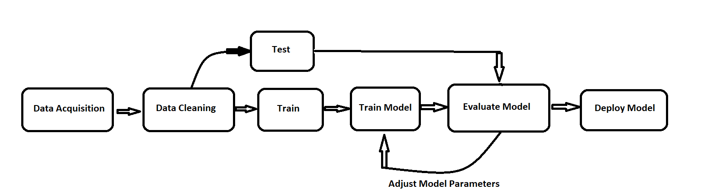

# TensorFlow Bootcamp Machine Learning

## What we will talk about? 
* we will talk about **supervised learning, unsupervised learning, reinforcement learning, evaluation methods** and more. 
* ML algorithms can find insights in data. 

## Supervised Learning 
* It uses labeled data to predict a label given some features. 
* If the label is continuos than its called **regression**, if its categorical it is a **classification** problem. 
* Example for Classification Problem 
> Suppose we have some features **Height and Weights** and we have label **Gender** 
> we need to predict their **gender**. 

* Example for Regression Problem
> We have features like **Square Footage, Rooms** and we have label **House Price**, So given a house's size and number of rooms, predict the selling price. 

* Supervised Learning has the model train on historical data that is already labeled 
* Once the model is trained, it can then be used on new data, where only the features are known, to attempt prediction. 
* But if we dont have the historical labels then what will we do? we need to look for **patterns** in the data and find a structure. Then we move on to **Unsupervised Learning** 

## Unsupervised Learning
* When we dont have the labels or any type of historical values then we use **Unsupervised Learning** 
* Here we have **Clusters** or we can say **Clustering**.
* Our task is to cluster it into similar groups. 
* Example
> We have a data, on which we have features like **Heights and Weights** for breeds of dogs and we have no **labels**. Our Taks will be to **cluster together** the data into similar groups. It is then up to the **data scientist to interpret the cluster**.

* Clustering wont be able to tell us what the group labels should be but it will split the data on the basis of their similarity. 

## Reinforcement Learning 
* So this learning method works through trail and error which actions yeild the greatest rewards. 
* Components 
	* **Agent**-Learning/Decision Maker
	* **Environment** - what Agent interacts with 
	* **Actions** - What the Agent can do. 
* So the agent chooses actions that maximize some specified reward metric over a given amount of time. 
* Then the agent will learn the best policy with the environment and will response with best actions. 

## Work Flow 

* Data Acquisition: well we need to acquire data for our task so basically it depends on the task.
* Data Cleaning: We need to clean the data, split clean tak out edges or normalaize the data. 
* Test & Train: ratio could be 30% on test and 70% on trainning.
* Train Model: we now fit our model with the training set. like the model that we'll be using now we need to fit our data into the model and we need to train the model with our data. 
* Evaluate Model: now we evaluate the model with our test data. 
*Now Adjust the Model Parameters*
* Deploy Model: now if all goes well then just deploy the model. 
> On **Unspuervised learning** we dont have any test set because we dont have any label. So we use all the data as **training data and evaluate the model with the training data**. So that we can justify our model. 